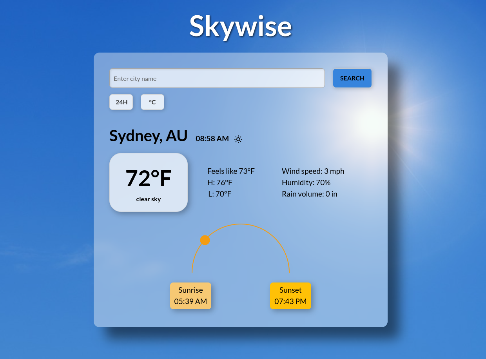
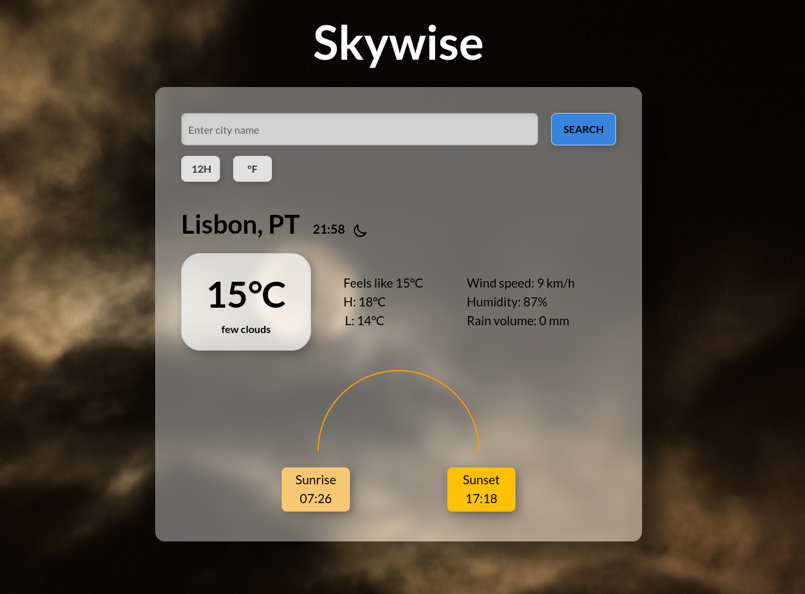

# Skywise 🌤️ - A Weather Application

Skywise is a simple weather React application that provides real-time weather information with dynamic visual elements and location-based updates.

#### 🔗 [Live Demo](https://weather-app-react-die-catia-monteiro.vercel.app)

## Table of Contents

- [Introduction](#introduction)
- [Key Features](#key-features)
- [Tech Stack](#tech-stack)
- [Preview](#preview)

## Introduction

Skywise combines accurate weather data with dynamic backgrounds that change based on weather conditions and time of day. The application provides both current weather conditions and detailed forecasts.

Skywise is designed for **desktop use only**. For the best experience, please access the application on a desktop browser.

## Key Features

### 1. Dynamic Weather Display

- Real-time weather updates
- Dynamic backgrounds reflecting current weather conditions and time of day (day/night)
- Day/night cycle visualization
- Temperature, humidity, and wind speed monitoring

### 2. Location Services

- Geolocation-based weather detection
- City search functionality
- Global weather coverage

### 3. Visual Elements

- Interactive sun movement tracker
- Sunrise and sunset times
- Dynamic day/night icons
- Weather-specific backgrounds

### 4. Customization Options

- Temperature unit toggle (°C/°F)
- Time format toggle (12/24 hour)
- Wind speed units (km/h/mph)
- Precipitation units (mm/inches)

## Tech Stack

### Frontend

- React 18
- Vite
- TailwindCSS
- Custom CSS animations

### Backend & Services

- Node.js for handling weather API requests
- Express for managing API routes for weather data and forecasts
- OpenWeather API integration
- Vercel for deployment

## Preview

---

Made with ❤️ by [Cátia Monteiro](https://github.com/diecatiamonteiro). Thanks for reading!
